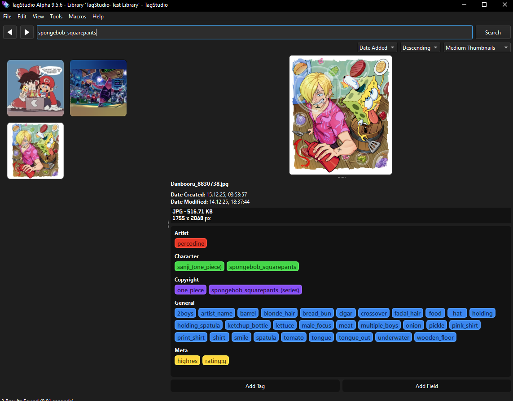

# DFD to TagStudio Importer

This tool is designed to import tags from a database created by the [Danbooru Favourites Downloader](https://github.com/quipsol/Danbooru-Favourites-Downloader) into a [TagStudio](https://docs.tagstud.io) library. **This tool does not move the files themselves but only imports associated tags**.


---

## Getting Started

You have **two supported ways** to use this project:

1. **Docker (recommended for developers & technical users)**
2. **Pre-built executables (recommended for non-technical users)**

>Running the raw Python files directly is still possible, but **Docker is now the recommended method**.

---

## Option 1: Using Docker

Docker allows you to run the downloader without installing Python or any dependencies on your system.

### Requirements

* Docker
* Docker Compose

### Setup

1. Clone or download this repository
2. Create a file named **`.env.docker`** in the project root
3. Add the following values to `.env.docker`:

```
DFD_DATABASE_LOCATION=<absolute path to your Danbooru Favourites Downloader database>
TAG_STUDIO_DATABASE_LOCATION=<absolute path to your TagStudio library database>

IMPORT_IMPLICATIONS=True
SLOW_MODE=False
UGOIRA_IS_WEBP=True

ARTIST_COLOR=tagstudio-standard,red-orange
COPYRIGHT_COLOR=tagstudio-standard,indigo
CHARACTER_COLOR=tagstudio-standard,green
GENERAL_COLOR=tagstudio-standard,blue
META_COLOR=tagstudio-standard,yellow
```

> **Note**
> Docker uses `.env.docker`.
> The raw Python scripts expect `.env` instead.

### Building the Docker Image

From the project directory, run:

```
docker compose build
```

### Running the Downloader

Run any of the supported modes using Docker Compose:

```
docker compose run dfd-to-ts
```

---

## Option 2: Pre-built Executables (No Python/Docker Required)

For users who don't want to run Python or Docker, **pre-packaged executables are available**.

### [Downloads](https://github.com/quipsol/DFD-to-TagStudio-Importer/releases)

Each release provides **three zip files**:

* **Windows**
* **Linux**
* **macOS**

Each zip contains:

* Executable
* A **pre-made `.env` file** (you must edit this)
* A copy of this **README**

### How to Use

1. Download the zip file for your operating system
2. Extract it anywhere on your system
3. Open the `.env` file and fill in your own values:

   ```
    DFD_DATABASE_LOCATION=<path to your Danbooru Favourites Downloader database>
    TAG_STUDIO_DATABASE_LOCATION=<path to your TagStudio library database>

    IMPORT_IMPLICATIONS=True|False
    SLOW_MODE=True|False
    UGOIRA_IS_WEBP=True|False

    ARTIST_COLOR=tagstudio-standard,red-orange
    COPYRIGHT_COLOR=tagstudio-standard,indigo
    CHARACTER_COLOR=tagstudio-standard,green
    GENERAL_COLOR=tagstudio-standard,blue
    META_COLOR=tagstudio-standard,yellow
   ```
4. Run the executable

---

## Environment Variables

| Variable               | Description                                                  
| ---------------------- | -------------------------------------------------------------
| DFD_DATABASE_LOCATION  | path to the DFD database (post-downloads.db)                                   
| TAG_STUDIO_DATABASE_LOCATION | path to the TagStudio library database (ts_library.sqlite)
| IMPORT_IMPLICATIONS    | Whether to import implications (True/False)
| SLOW_MODE              | Whether to run in slow mode (True/False)
| UGOIRA_IS_WEBP         | Should match CONVERT_UGOIRA_TO_WEBP from the DFD `.env` file
| any _COLOR             | The color for the respective tag type

_COLOR variables have default values set to closely match the respective colors on Danbooru. You can find all available colors either in the TagStudio software or on their website here: https://docs.tagstud.io/colors/#tag-color-manager

The color "TagStudio Grayscale -> Dark Gray" would be written as `tagstudio-grayscale,dark-gray`.

<br>

If this tool is in the same folder as the DFD tool, you can merge the two `.env` files into one.

---

### What are implications?

An Implication would be the tag ***absurdres*** implying the tag ***highres***. Any file with the tag ***absurdres*** would therefore automatically have the tag ***highres*** too.
If you set the environment variable `IMPORT_IMPLICATIONS` to `True`, the tool will import all relevant implications from the Danbooru Website into the TagStudio library.

This has no effect on how the tags are displayed in TagStudio! It merely adds the implication relation to the TagStudio library, so that in the future, if you tag a file inside of TagStudio with ***absurdres***, TagStudio will automatically also add the tag ***highres*** to that file. (Or any other relation between tags)


---

## Notes on running this tool


**The file names that the *Danbooru Favourites Downloader* creates must be left unchanged!**

For a smooth experience it is recommended to do the following

1. Set the *Danbooru Favourites Downloader* file save location to the folder of the TagStudio library.
2. After downloading new files from Danbooru, start TagStudio and refresh the library (**CTRL/CMD+R** or click on **Files -> Refresh Directories**). Otherwhise these new files will not exist within the TagStudio database.
3. Run this tool.

<br>

*Example of imported tags in TagStudio*


